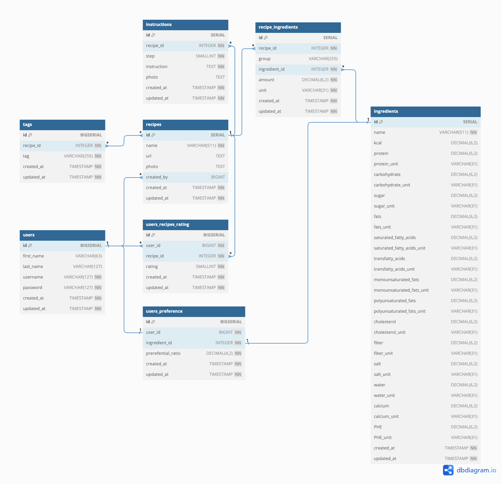

# Design Document

By Jaroslav Girovsky

## Scope
The PostgreSQL database, named "Healthy Recipes," manages and organizes information for a recipe-sharing platform. In addition to storing recipes, instructions, and ingredients, it provides nutrition details based on the ingredients used. The database also keeps track of users' recipe ratings and their ingredient preferences.

Included in the scope of the database are details about:
Users: This includes their names, usernames, and passwords.
Recipes: Basic details about culinary recipes, such as names, URLs, photos, and creators.
Instructions: Step-by-step guidance for preparing a recipe.
Ingredients: General information about individual food items used in recipes, including nutritional data like kcal, protein, carbohydrate, etc.
Recipe-Ingredients: Information linking recipes with the ingredients they contain, along with quantities and units.
Tags: User-assigned tags for categorizing recipes.
User Ratings: Ratings given by users to recipes, falling within the range of -10 to 10.
User Preferences: Users' inclinations toward specific ingredients, including a preferential ratio calculated based on users' ratings of recipes featuring a particular ingredient.

Outside the scope of the database are detailed user information, user authentication and authorization mechanisms, more advanced unit-based nutrition calculations, and sophisticated rating-based computations, as well as users' comments on the recipes. There is no support for video recipe sources.

## Functional Requirements
A user should be able to:
* Perform CRUD Operations: Users should be able to Create, Read, Update, and Delete their information, recipes (including instructions and linked ingredients), and individual ingredients.
* Manage Ratings and Tags: Users have the capability to Store, Update, and Delete their ratings for recipes. Additionally, they can tag recipes for categorization purposes.
* Access Nutritional Information: Users can view nutritional calculations for recipes based on the ingredients used.
* Receive Recipe Preferences: The system proposes preferences for unrated recipes based on information derived from rated recipes.

Beyond the scope of what a user should be able to do with your database:
* User-Friendly Recipe Storing Procedure: The database does not currently offer a user-friendly procedure for storing recipes due to its complexity. The actual recipe creation and input process are to be handled through a more user-friendly interface in the application layer.
* Ingredient Categorization: The database does not support ingredient categorization, which could have a significant impact on advanced recommendation calculations.
* Unit Conversion: The database functions for the calculation of nutritional information do not support various measurement units for recipes. It only uses the same units as those used in general nutritional information about ingredients.
* User's comments: The database does not store comments and textual feedbacks on the recipes.

## Representation
Entities are captured in SQLite tables with the following schema.

### Entities
The database includes the following entities:

#### Users
The `users` table includes the following fields:
* `id`: This field represents the unique ID for the user, defined as `BIGSERIAL` in case the app had users all around the globe. It serves as the primary key, ensuring each user has a distinct identifier.
* `first_name`: This field captures the user's first name and is defined as `VARCHAR(63)`. The chosen length of 63 characters is considered satisfactory for typical first names.
* `last_name`: Similar to `first_name`, this field stores the user's last name and is defined as `VARCHAR(127)`. The extended length of 127 characters accommodates longer last names.
* `username`: This field holds the user's username and is defined as `VARCHAR(127)`. A `UNIQUE` constraint ensures that each username is distinct, and a `NOT NULL` constraint guarantees that every user has a username.
* `password`: This field stores the user's login password as `VARCHAR(127)`. The chosen length of 127 characters is deemed sufficient for secure passwords. The `NOT NULL` constraint ensures that a password is mandatory for user login.
* `created_at`: This field indicates the timestamp when a user record was created. It is defined as `TIMESTAMP`, and the PostgreSQL `now()` function sets its default value. The `NOT NULL` constraint is useful to keep track of coming new users.
* `updated_at`: Similar to `created_at`, this field tracks the timestamp of the last record update. It shares the same type, constraints, and default value as `created_at`, ensuring consistency in recording update times.

#### Recipes
The `recipes` table includes the following fields:
* `id`: This field represents the unique ID for the user, defined as `SERIAL` which should cover more than enough recipes. It serves as the primary key.
* `name`: This field captures recipe name and is defined as `VARCHAR(511)` since there might be similar recipes so each name should be `UNIQUE` and that could mean that name could get longer. For the obvious reasons it cannot stay blank so `NOT NULL` ensures it.
* `url`: This field stores url of external source of the recipe if there is such. Since urls can be of various sizes, it seems prudent to use `TEXT` type. However it must be `UNIQUE`. The opposite would mean to store the same recipes (although under different names).
* `photo`: This field stores url of title image for recipe if there is such. For the same reason as `url` field, type is `TEXT`. A `UNIQUE` constraint is not necessesary, since there might be used cover image for some recipes in the future. (To my knowledge, it is not a good solution to store the binary data of an image itself in the field; rather, the address of that image.)
* `created_by`: This field is a foreign key which references to id of a user, who added recipe into the database and can update it as well. For that reason the type is `BIGINT` which correspondes to user's id type - `BIGSERIAL`. However recipes can be obtained from other dataset as well, so the field can stay empty as well. In case a user deletes his account, the field will be `SET NULL`.
* `created_at`: The reason and settings of the field is the same as in case of `users` table.
* `updated_at`: The reason and settings of the field is the same as in case of `users` table.

#### Instructions
The `instructions` table includes the following fields:
* `id`: This field represents the unique ID for the instruction, defined as `SERIAL`. It serves as the primary key.
* `recipe_id`: This field links the instruction to a recipe; therefore, it is of type `INTEGER`. It cannot stay empty, so a `NOT NULL` constraint is applied because every instruction must belong to a certain recipe. In case a recipe is deleted, the instruction should also be deleted, so an `ON DELETE CASCADE` constraint is applied.
* `step`: This field stores a step of recipe instructions since recipes could be more complex and have multiple steps; however, not too many, so the type `SMALLINT` should cover that. Each recipe should have at least one instruction, so a `NOT NULL` constraint is applied.
* `instruction`: This field stores the text of the instruction, and as such, it can have various lengths. For that reason, the field is of type `TEXT`. Obviously, it must be set as `NOT NULL`.
* `photo`: This field stores the URL of an image for a particular instruction if there is one. For the same reason as the `url` field, the type is `TEXT`.
* `created_at`: The reason and settings of the field are the same as in the case of the `users` table.
* `updated_at`: The reason and settings of the field are the same as in the case of the `users` table.
A `UNIQUE` constraint is applied for the combination of fields `recipe_id` and `step` to avoid possible confusion if the wrong step number is inserted with a recipe instruction.

#### Ingredients
The `ingredients` table includes the following fields:
* `id`: This field represents the unique ID for the ingredient, defined as `SERIAL`. It serves as the primary key.
* `name`: This field captures the ingredient name and is defined as `VARCHAR(511)` since there might be similar ingredients, so each name should be `UNIQUE`, and that could mean that the name could get longer. For obvious reasons, it cannot stay blank, so `NOT NULL` ensures it.
* `kcal`: The field should store the nutritional value of 100g of the ingredient. For that, `DECIMAL(6,2)` should be satisfactory. Since the dataset might not cover all nutritional information, the constraint `NOT NULL` is not implied. It is highly recommended in this case.
* `protein`: The field should store the nutritional value of 100g of the ingredient. For that, `DECIMAL(6,2)` should be satisfactory. Since the dataset might not cover all nutritional information, the constraint `NOT NULL` is not implied. It is highly recommended in this case.
* `protein_unit`: The field stores the unit of nutritional value (like "mg," "g," "kg," "ml," "l"). For that, `VARCHAR(31)` should be satisfactory. Since the dataset might not cover all nutrition information, the constraint `NOT NULL` is not implied. It is highly recommended in this case.
* `carbohydrate`: The field should store the nutritional value of 100g of the ingredient. For that, `DECIMAL(6,2)` should be satisfactory. Since the dataset might not cover all nutritional information, the constraint `NOT NULL` is not implied. It is highly recommended in this case.
* `carbohydrate_unit`: The field stores the unit of nutritional value (like "mg," "g," "kg," "ml," "l"). For that, `VARCHAR(31)` should be satisfactory. Since the dataset might not cover all nutrition information, the constraint `NOT NULL` is not implied. It is highly recommended in this case.
* `sugar`: The field should store the nutritional value of 100g of the ingredient. For that, `DECIMAL(6,2)` should be satisfactory. Since the dataset might not cover all nutritional information, the constraint `NOT NULL` is not implied. It is recommended.
* `sugar_unit`: The field stores the unit of nutritional value (like "mg," "g," "kg," "ml," "l"). For that, `VARCHAR(31)` should be satisfactory. Since the dataset might not cover all nutrition information, the constraint `NOT NULL` is not implied. It is recommended.
* `fats`: The field should store the nutritional value of 100g of the ingredient. For that, `DECIMAL(6,2)` should be satisfactory. Since the dataset might not cover all nutritional information, the constraint `NOT NULL` is not implied. It is highly recommended in this case.
* `fats_unit`: The field stores the unit of nutritional value (like "mg," "g," "kg," "ml," "l"). For that, `VARCHAR(31)` should be satisfactory. Since the dataset might not cover all nutrition information, the constraint `NOT NULL` is not implied. It is highly recommended in this case.
* `saturated_fatty_acids`: The field should store the nutritional value of 100g of the ingredient. For that, `DECIMAL(6,2)` should be satisfactory. Since the dataset might not cover all nutritional information, the constraint `NOT NULL` is not implied. It is recommended.
* `saturated_fatty_acids_unit`: The field stores the unit of nutritional value (like "mg," "g," "kg," "ml," "l"). For that, `VARCHAR(31)` should be satisfactory. Since the dataset might not cover all nutrition information, the constraint `NOT NULL` is not implied. It is recommended.
* `transfatty_acids`: The field should store the nutritional value of 100g of the ingredient. For that, `DECIMAL(6,2)` should be satisfactory. Since the dataset might not cover all nutritional information, the constraint `NOT NULL` is not implied. It is recommended.
* `transfatty_acids_unit`: The field stores the unit of nutritional value (like "mg," "g," "kg," "ml," "l"). For that, `VARCHAR(31)` should be satisfactory. Since the dataset might not cover all nutrition information, the constraint `NOT NULL` is not implied. It is recommended.
* `monounsaturated_fats`: The field should store the nutritional value of 100g of the ingredient. For that, `DECIMAL(6,2)` should be satisfactory. Since the dataset might not cover all nutritional information, the constraint `NOT NULL` is not implied. It is recommended.
* `monounsaturated_fats_unit`: The field stores the unit of nutritional value (like "mg," "g," "kg," "ml," "l"). For that, `VARCHAR(31)` should be satisfactory. Since the dataset might not cover all nutrition information, the constraint `NOT NULL` is not implied. It is recommended.
* `polyunsaturated_fats`: The field should store the nutritional value of 100g of the ingredient. For that, `DECIMAL(6,2)` should be satisfactory. Since the dataset might not cover all nutritional information, the constraint `NOT NULL` is not implied. It is recommended.
* `polyunsaturated_fats_unit`: The field stores the unit of nutritional value (like "mg," "g," "kg," "ml," "l"). For that, `VARCHAR(31)` should be satisfactory. Since the dataset might not cover all nutrition information, the constraint `NOT NULL` is not implied. It is recommended.
* `cholesterol`: The field should store the nutritional value of 100g of the ingredient. For that, `DECIMAL(6,2)` should be satisfactory. Since the dataset might not cover all nutritional information, the constraint `NOT NULL` is not implied. It is recommended.
* `cholesterol_unit`: The field stores the unit of nutritional value (like "mg," "g," "kg," "ml," "l"). For that, `VARCHAR(31)` should be satisfactory. Since the dataset might not cover all nutrition information, the constraint `NOT NULL` is not implied. It is recommended.
* `fiber`: The field should store the nutritional value of 100g of the ingredient. For that, `DECIMAL(6,2)` should be satisfactory. Since the dataset might not cover all nutritional information, the constraint `NOT NULL` is not implied. It is highly recommended in this case.
* `fiber_unit`: The field stores the unit of nutritional value (like "mg," "g," "kg," "ml," "l"). For that, `VARCHAR(31)` should be satisfactory. Since the dataset might not cover all nutrition information, the constraint `NOT NULL` is not implied. It is highly recommended in this case.
* `salt`: The field should store the nutritional value of 100g of the ingredient. For that, `DECIMAL(6,2)` should be satisfactory. Since the dataset might not cover all nutritional information, the constraint `NOT NULL` is not implied. It is recommended.
* `salt_unit`: The field stores the unit of nutritional value (like "mg," "g," "kg," "ml," "l"). For that, `VARCHAR(31)` should be satisfactory. Since the dataset might not cover all nutrition information, the constraint `NOT NULL` is not implied. It is recommended.
* `water`: The field should store the nutritional value of 100g of the ingredient. For that, `DECIMAL(6,2)` should be satisfactory. Since the dataset might not cover all nutritional information, the constraint `NOT NULL` is not implied. It is recommended.
* `water_unit`: The field stores the unit of nutritional value (like "mg," "g," "kg," "ml," "l"). For that, `VARCHAR(31)` should be satisfactory. Since the dataset might not cover all nutrition information, the constraint `NOT NULL` is not implied. It is recommended.
* `calcium`: The field should store the nutritional value of 100g of the ingredient. For that, `DECIMAL(6,2)` should be satisfactory. Since the dataset might not cover all nutritional information, the constraint `NOT NULL` is not implied. It is recommended.
* `calcium_unit`: The field stores the unit of nutritional value (like "mg," "g," "kg," "ml," "l"). For that, `VARCHAR(31)` should be satisfactory. Since the dataset might not cover all nutrition information, the constraint `NOT NULL` is not implied. It is recommended.
* `PHE`: The field should store the nutritional value of 100g of the ingredient. For that, `DECIMAL(6,2)` should be satisfactory. Since the dataset might not cover all nutritional information, the constraint `NOT NULL` is not implied. It is recommended.
* `PHE_unit`: The field stores the unit of nutritional value (like "mg," "g," "kg," "ml," "l"). For that, `VARCHAR(31)` should be satisfactory. Since the dataset might not cover all nutrition information, the constraint `NOT NULL` is not implied. It is recommended.
* `created_at`: The reason and settings of the field is the same as in case of `users` table.
* `updated_at`: The reason and settings of the field is the same as in case of `users` table.

#### Ingredients of recipes
The middle table `recipe_ingredients` includes the following fields:
* `id`: This field represents the unique ID for the ingredient, defined as `SERIAL`. It serves as the primary key.
* `recipe_id`: This field links the record to a recipe; therefore, it is of type `INTEGER`. It cannot stay empty, so a `NOT NULL` constraint is applied because every record must belong to a certain recipe. In case a recipe is deleted, the linking record should also be deleted, so an `ON DELETE CASCADE` constraint is applied.
* `group`: This field groups ingredients into a certain part of a recipe since an ingredient can be used in various parts of the same recipe. The part can have various names, but `VARCHAR(255)` should satisfy every occasion. For simple recipes, it can be left blank.
* `ingredient_id`: This field links the record to an ingredient; therefore, it is of type `INTEGER`. It cannot stay empty, so a `NOT NULL` constraint is applied because every record must link to a certain ingredient. For deleting an ingredient used in a recipe, the constraint `ON DELETE RESTRICT` is applied since there is no reason to delete information about ingredient.
* `amount`: The field represents the amount of an ingredient used in a specific part of a recipe. For the possibility of various units, it is of type `DECIMAL(6,2)`. Since the record makes sense only when some amount of an ingredient is used in a recipe, the field must have a `NOT NULL` value, and it is also set as `DEFAULT 1`.
* `unit`: The field stores the unit of the used ingredient (like "g," "kg," "ml," "l," "spoon," "teaspoon"). Therefore, it is of type `VARCHAR(31)`. For the same reason as in the case of `amount`, the field has a `NOT NULL` constraint.
* `created_at`: The reason and settings of the field are the same as in the case of the `users` table.
* `updated_at`: The reason and settings of the field are the same as in the case of the `users` table.
A `UNIQUE` constraint is applied to the combination of fields `recipe_id`, `ingredient_id`, and `group` since the same ingredient can be used in different amounts in different parts of a recipe.

#### Tags
The `tags` table includes the following fields:
* `id`: This field represents the unique ID for the ingredient, defined as `SERIAL`. It serves as the primary key.
* `recipe_id`: This field links the tag to a recipe; therefore, it is of type `INTEGER`. It cannot stay empty, so a `NOT NULL` constraint is applied because every tag must belong to a certain recipe. In case a recipe is deleted, the tag record should also be deleted, so an `ON DELETE CASCADE` constraint is applied.
* `tag`: The field sets certain attribute of a recipe but it should not be long, a few words the most. It should fit in `VARCHAR(255)`. Field cannot stay empty, so its is set as `NOT NULL`.
* `created_at`: The reason and settings of the field are the same as in the case of the `users` table.
* `updated_at`: The reason and settings of the field are the same as in the case of the `users` table.
To avoid possible duplicity of tags for the same recipe, a `UNIQUE` constraint is applied to the combination of fields `recipe_id` and `tag`.

#### Recipes rating
The `users_recipes_rating` table includes the following fields:
* `id`: This field represents the unique ID for the record of a recipe rated by a user. Since there could be billions of user and recipe combinations, it is defined as `BIGSERIAL`. It serves as the primary key.
* `user_id`: This field is a foreign key that references the ID of a user who rated the recipe and can update this rating as well. For that reason, the type is `BIGINT`, corresponding to the user's ID type - `BIGSERIAL`. Since a rating must have a user who rated it, it is set as `NOT NULL`. In case of a user deleting their own account, the rating records will be deleted as well, so an `ON DELETE CASCADE` constraint is applied.
* `recipe_id`: This field links the record to a recipe; therefore, it is of type `INTEGER`. It cannot stay empty, so a `NOT NULL` constraint is applied because every record must belong to a certain recipe. In case a recipe is deleted, the linking record should also be deleted, so an `ON DELETE CASCADE` constraint is applied.
* `rating`: The field stores the rating value of a recipe. The value can be between -10 (representing deep dislike) and 10 (representing delicious taste); therefore, a `CHECK` constraint is applied. Since no decimal numbers are allowed and values are low, the type of the field is `SMALLINT`. It is also a mandatory field without which the whole record loses its sense, so a `NOT NULL` constraint is applied. By `DEFAULT 0`, the value of the rating is set as neutral.
* `created_at`: The reason and settings of the field are the same as in the case of the `users` table.
* `updated_at`: The reason and settings of the field are the same as in the case of the `users` table.
To avoid duplicity of rating the same recipe by the same user, a `UNIQUE` constraint is applied on the combination of fields `user_id` and `recipe_id`.

#### User's preference
The `users_preference` table includes the following fields:
* `id`: This field represents the unique ID for the record of a user's preference for a certain ingredient. Since there could exist billions of user and recipe combinations, it is defined as `BIGSERIAL`. It serves as the primary key.
* `user_id`: This field is a foreign key that references the ID of a user whose liking of the ingredient is calculated in this record. For that reason, the type is `BIGINT`, which corresponds to the user's ID type - `BIGSERIAL`. As a necessary field, it is set as `NOT NULL`. In case a user deletes their account, these records will be deleted as well, so the `ON DELETE CASCADE` constraint is applied.
* `ingredient_id`: This field links the record to an ingredient; therefore, it is of type `INTEGER`. It is set as a `NOT NULL` constraint because every record must be linked to a certain ingredient. For deleting an ingredient used in a recipe, the constraint `ON DELETE RESTRICT` is applied since there is no reason to delete information about the ingredient.
* `prerefential_ratio`: The field stores the value of the user's preference for an ingredient. The value is calculated automatically as an average of the user's ratings of recipes in which the ingredient is used. The value will be between -10 and 10, but most likely, it is going to have decimal numbers, so the field is of type `decimal(4,2)`. It is a mandatory field, set as `NOT NULL` with a `DEFAULT 0` value, even though it is filled automatically.
* `created_at`: The reason and settings of the field are the same as in the case of the `users` table.
* `updated_at`: The reason and settings of the field are the same as in the case of the `users` table.
To avoid duplicity in recording a user's preference for the same ingredient, a `UNIQUE` constraint is applied to the combination of fields `user_id` and `ingredient_id`.

### Relationships

The below entity relationship diagram describes the relationships among the entities in the database.

As detailed by the diagram:

* One user can create many recipes. However, a recipe might have an unknown source as well.
* One recipe has at least one to many instructions.
* One recipe is joined with ingredients through a middle table in which the record of the amount and recipe part is stored. Conversely, an ingredient might be used in none to many recipes or even multiple times in the same recipe in its different parts.
* One recipe might have none to many tags. Tags are, however, not unique and might have the same value. (The tag values are stored directly in what would normally be a middle table of recipe-tag relation.)
* One user can rate zero to many recipes, and a recipe can have zero to many ratings.
* Based on users' ratings of recipes, a user's preference for each ingredient in rated recipes is created automatically. Without rating any recipe, the user will not have any ingredient preference.

## Optimizations

### Indexes
Table `users` - Since it is a database for an informal app, the most searches are expected to be done on the `username` field. Therefore, an index was created on this field.
Table `recipes` - The most searched column in the entire database by the user is the recipe `name`. Consequently, an index was created on that column.
Table `instructions` - For quickly obtaining instructions for a recipe, an index was created on the column `recipe_id`.
Table `recipe_ingredients` - For quickly obtaining ingredient data for a recipe, an index was created on the columns `recipe_id` and `ingredient_id`.
Table `ingredients` - For quickly searching for an ingredient by users, an index was created on the `name` column.
Table `tags` - To retrieve tags for a recipe and search for recipes with the same tag, an index was created on the `recipe_id` and `tag` columns.
Table `users_recipes_rating` - For quickly searching users and recipes in records of ratings, an index was created for the columns `user_id` and `recipe_id`.
Table `users_preference` - For quickly obtaining results on a user's preference for certain ingredients, an index was created for the columns `user_id` and `ingredient_id`.

### Views
To extract the most information from the database while simplifying it for a database user, the following views were created:

#### recipes_info
This view displays basic information about recipes in columns: `id`, `recipe name`, `created by` (returns the username of the creator or 'unknown'), `rating` (calculates the average rating of a recipe), `kcal`, `carbohydrate`, `protein`, `fats`, `fiber` (calculations of basic nutritional information based on the `recipe_nutritions_info` view).

#### recipe_nutritions_info
This view provides detailed nutritional information for each recipe based on data stored in `recipe_ingredients` and `ingredients`. It calculates every nutritional value for the amount of ingredient used in the recipe and sums the values grouped by recipe.

#### recipe_ingredients_info
This view presents information in columns: `recipe_id`, `recipe name`, ingredient name as `ingredient`, prescribed ingredient `amount`, and the amount `unit` used in a certain part of the recipe specified as `group`. It also includes nutritional information such as `kcal`, `carbohydrate`, `protein`, `fats`, and `fiber` for that amount of ingredient used in the recipe part.

### Procedures
To simplify the query for inserting or updating a recipe rating, a procedure was created. It takes three arguments: 'username' of type `VARCHAR(127)`, 'exact recipe name' of type `VARCHAR(511)`, and 'rating between -10 to 10' of type `SMALLINT`.

### Triggers
To create and update users' preferences for ingredients when a user creates or updates a recipe, the trigger `users_recipes_rating_trigger` was created. It executes the `update_user_preference` function, which, for each ingredient used in a rated recipe, sets a new user preference ratio. For this, it executes the `calculate_preference` function, which finds all user ratings of recipes in which the ingredient was included and averages these ratings.

## Limitations
The user cannot set preferences on ingredients manually; they are determined through automatic calculations and always take the value set by the system.
User preferences are calculated solely based on used ingredients. The calculation does not consider tags or the amount of used ingredients in a recipe.
The database is demanding on the dataset, and in the case of different measurement units, it may produce inaccurate results.
